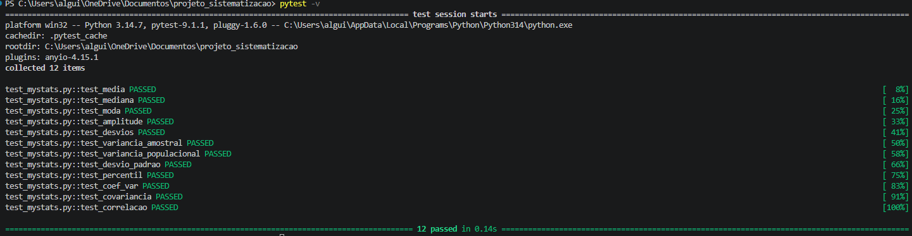

# Documentação do Projeto

## 1. Dataset e Justificativa

O dataset utilizado é composto por **1.470 registros de funcionários e 39 variáveis**, abrangendo informações relacionadas a características demográficas, remuneração, cargos, níveis de satisfação e tempo de permanência na empresa. Escolhi este dataset devido a quantidade de variaveis disponiveis para selecionar e com isso abre um leque de opções para testar.

---

---

## 3. Fórmulas do núcleo matemático

### 3.1 Média

A função `media(dados)` calcula a média aritmética:

$$
\bar{x} = \frac{1}{n}\sum_{i=1}^{n}x_i
$$

onde $x_i$ representa cada observação e $n$ é o número total de observações.

---

### 3.2 Mediana

A função `mediana(dados)` ordena os valores e identifica a posição central.

Para $n$ ímpar:

$$
Md = x_{\frac{n+1}{2}}
$$

Para $n$ par:

$$
Md = \frac{x_{\frac{n}{2}} + x_{\frac{n}{2}+1}}{2}
$$

---

### 3.3 Moda

A função `moda(dados)` identifica o valor que apresenta a maior frequência:

$$
Mo = \arg\max_x f(x)
$$

em que $f(x)$ representa a frequência de ocorrência do valor $x$.

---

### 3.4 Amplitude

A função `amplitude(dados)` calcula a diferença entre o maior e o menor valor:

$$
A = x_{\max} - x_{\min}
$$

---

### 3.5 Desvios em relação à média

A função `desvios(dados)` calcula o desvio de cada observação em relação à média:

$$
d_i = x_i - \bar{x}
$$

---

### 3.6 Variância

A função `variancia(dados)` calcula a variância.

Para a variância amostral:

$$
s^2 = \frac{\sum_{i=1}^{n}(x_i-\bar{x})^2}{n-1}
$$

Para a variância populacional:

$$
\sigma^2 = \frac{\sum_{i=1}^{n}(x_i-\bar{x})^2}{n}
$$

---

### 3.7 Desvio-padrão

A função `desvio_padrao(dados)` calcula a raiz quadrada da variância:

$$
s = \sqrt{s^2}
$$

---

### 3.8 Percentil

A função `percentil(dados, k)` determina o percentil $k$ utilizando a posição:

$$
P = \frac{k}{100}(n-1)
$$

Quando a posição não é inteira, é realizada interpolação linear entre os valores adjacentes:

$$
P_k = x_i + f(x_{i+1}-x_i)
$$

onde:

$$
i = \lfloor P \rfloor
$$

e

$$
f = P-i
$$

---

### 3.9 Quartis

A função `quartil(dados)` calcula os três quartis a partir dos percentis:

$$
Q_1 = P_{25}
$$

$$
Q_2 = P_{50}
$$

$$
Q_3 = P_{75}
$$

---

### 3.10 Coeficiente de variação

A função `coef_var(dados)` calcula a dispersão relativa em relação à média:

$$
CV = \frac{s}{\bar{x}}\times100
$$

---

### 3.11 Covariância

A função `covariancia(dados_x, dados_y)` calcula a covariância entre duas variáveis.

Para a forma amostral:

$$
Cov(X,Y) =
\frac{\sum_{i=1}^{n}(x_i-\bar{x})(y_i-\bar{y})}{n-1}
$$

Para a forma populacional, o denominador utilizado é $n$.

---

### 3.12 Correlação

A função `correlacao(dados_x, dados_y)` utiliza a covariância e os desvios-padrão das duas variáveis:

$$
r = \frac{Cov(X,Y)}{s_Xs_Y}
$$

O resultado varia entre $-1$ e $1$, indicando a direção e a intensidade da relação linear entre as variáveis.

### 3.13 Regressão linear simples

A função `regressao_linear(x, y)` utiliza o método dos mínimos quadrados.

O coeficiente angular da reta é calculado por:

$$
b_1 =
\frac{\sum_{i=1}^{n}(x_i-\bar{x})(y_i-\bar{y})}
{\sum_{i=1}^{n}(x_i-\bar{x})^2}
$$

O intercepto é:

$$
b_0 = \bar{y} - b_1\bar{x}
$$

Assim, o valor estimado de $y$ é:

$$
\hat{y} = b_0 + b_1x
$$

Por fim, o coeficiente de determinação é:

$$
R^2 =
1 -
\frac{\sum_{i=1}^{n}(y_i-\hat{y}_i)^2}
{\sum_{i=1}^{n}(y_i-\bar{y})^2}
$$

O $R^2$ representa a proporção da variabilidade de $Y$ explicada pelo modelo de regressão linear.

## 4. Validação dos testes

# 5. Prints/explicação de cada módulo

Neste módulo, inclui o selectbox para quando selecionar uma variavel categórica apresentasse o grafico de barra, enquanto para as variáveis numéricas apresentasse o histograma(com linha de média, mediana e moda), o grafico de dispersão(com a faixa designando ± Desvio Padrão) e boxplot com a regra IQR, o usuário também pode escolher o tamanho da amostra(O valor máximo é populacional).

O módulo começa apresentando a Lei dos grandes números e com o gráfico podemos observar que há medida que o tamanho da amostra aumenta a média acumulada da variável escolhida se aproxima da média esperada, enquanto que na da Teoria central do limite nós observamos que na medida que aumentamos o numero de repetições, o gráfico começa representar uma distribuição normal.

O histograma da variável YearsAtCompany, apresenta uma distribuição assimétrica que não se encaixa muito bem com a curva normal, enquanto que a curva exponencial apresenta uma adequação melhor com a variável.

Neste módulo o usuário pode escolher 2 variáveis numéricas para obter um gráfico com correlação entre elas, onde encontrará os dados com uma linha representando a regressão linear, e também pode digitar um valor para prever Ŷ.

## 6. As três descobertas

1 - Há uma correlação menor entre o salário e anos dentro da companhia do que a correlação entre salario e o total de anos trabalhado.
2 - A correlação entre salário e idade é fraca, esperava que quanto maior fosse a idade provavelmente maior o salário.
3 - A correlaçäo mais forte com salário é com nível de senioridade, talvez implique que a empresa reconhece mais o mérito do que os anos dentro da companhia.